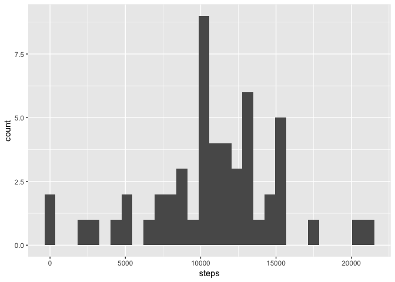

## Loading and preprocessing the data
First we need to load the libraries neccecary for this analysis:


```r
library(tidyverse)
```

```
## Registered S3 methods overwritten by 'ggplot2':
##   method         from 
##   [.quosures     rlang
##   c.quosures     rlang
##   print.quosures rlang
```

```
## Registered S3 method overwritten by 'rvest':
##   method            from
##   read_xml.response xml2
```

```
## ── Attaching packages ──────────────────────────────────────────────────────────────── tidyverse 1.2.1 ──
```

```
## ✔ ggplot2 3.1.1       ✔ purrr   0.3.2  
## ✔ tibble  2.1.1       ✔ dplyr   0.8.0.1
## ✔ tidyr   0.8.3       ✔ stringr 1.4.0  
## ✔ readr   1.3.1       ✔ forcats 0.4.0
```

```
## ── Conflicts ─────────────────────────────────────────────────────────────────── tidyverse_conflicts() ──
## ✖ dplyr::filter() masks stats::filter()
## ✖ dplyr::lag()    masks stats::lag()
```

```r
library(lubridate)
```

```
## 
## Attaching package: 'lubridate'
```

```
## The following object is masked from 'package:base':
## 
##     date
```

Then we download the data


```r
fileURL <- "https://d396qusza40orc.cloudfront.net/repdata%2Fdata%2Factivity.zip"
download.file(fileURL, "./activity.zip", method = "curl")
unzip("./activity.zip", exdir = ".")
        file.remove("./activity.zip")
```

```
## [1] TRUE
```

```r
        rm(fileURL)
```

And then import the data as a dataframe, which we can use in later stages.


```r
activity <- read.csv("activity.csv")
```


## What is mean total number of steps taken per day?
Then we need to transform this for the first question. 

```r
steps_day <- activity %>%
        group_by(date) %>%
        summarise(steps = sum(steps))
```
And we take this to create a histogram

```r
ggplot(steps_day, aes(steps)) + geom_histogram()
```

```
## `stat_bin()` using `bins = 30`. Pick better value with `binwidth`.
```

```
## Warning: Removed 8 rows containing non-finite values (stat_bin).
```

<!-- -->
and then the mean and median

```r
mean(steps_day$steps, na.rm = TRUE)
```

```
## [1] 10766.19
```

```r
median(steps_day$steps, na.rm = TRUE)
```

```
## [1] 10765
```


## What is the average daily activity pattern?
To answer this question we need to transform the data again, to summarise in a different way.

```r
steps_interval <- activity %>%
        group_by(interval) %>%
        summarise(steps = mean(steps, na.rm = TRUE))
```

This we can use to create a line plot

```r
ggplot(steps_interval, aes(interval, steps)) + geom_line()
```

<!-- -->

and also to find out the maximum interval

```r
steps_interval[which.max(steps_interval$steps),]
```

```
## # A tibble: 1 x 2
##   interval steps
##      <int> <dbl>
## 1      835  206.
```


## Imputing missing values
First we calculate the number of NAs in the activity dataframe

```r
sum(is.na(activity))
```

```
## [1] 2304
```
Then we need to fill these NAs with something. I choose to use the average interval that was calculated in the previous section. 


```r
steps_interval <- activity %>%
        group_by(interval) %>%
        summarise(steps = mean(steps, na.rm = TRUE))

no_na_activity<-activity

# sapply goes thru every unique interval...
sapply(no_na_activity$interval, function(interval_i){
        # replace missing steps of interval_i in no_na_activity with the steps mean of interval_i of           steps_interval
        no_na_activity$steps[is.na(no_na_activity$steps) & no_na_activity$interval == interval_i] <<- mean(steps_interval$steps[steps_interval$interval == interval_i], na.rm= TRUE)
        # and the <<- operator assigns it to no_na_activity outside of sapply
})
```

meaning that we now can have replaced the NAs in activity with the meansn from steps_interval. 

```r
head(activity)
```

```
##   steps       date interval
## 1    NA 2012-10-01        0
## 2    NA 2012-10-01        5
## 3    NA 2012-10-01       10
## 4    NA 2012-10-01       15
## 5    NA 2012-10-01       20
## 6    NA 2012-10-01       25
```

```r
head(no_na_activity)
```

```
##       steps       date interval
## 1 1.7169811 2012-10-01        0
## 2 0.3396226 2012-10-01        5
## 3 0.1320755 2012-10-01       10
## 4 0.1509434 2012-10-01       15
## 5 0.0754717 2012-10-01       20
## 6 2.0943396 2012-10-01       25
```

We can then take this information to calculate a new histogram. 

```r
ggplot(no_na_activity, aes(steps)) + geom_histogram()
```

```
## `stat_bin()` using `bins = 30`. Pick better value with `binwidth`.
```

<!-- -->
and can then recalculate the mean and median, which is quite a lot less than before the NAs were removed:

```r
mean(no_na_activity$steps, na.rm = TRUE)
```

```
## [1] 37.3826
```

```r
median(no_na_activity$steps, na.rm = TRUE)
```

```
## [1] 0
```

## Are there differences in activity patterns between weekdays and weekends?
First we need to create the factor variable

```r
no_na_activity$date <- ymd(no_na_activity$date) #use lubridate to parse into date-format
no_na_activity <- mutate(no_na_activity,weekday = weekdays(as.Date(no_na_activity$date))) #mutate into new variable with weekday names
no_na_activity$weekday = ifelse(no_na_activity$weekday %in% c("Saturday", "Sunday"), "weekend", "weekday") #change that into a factor with saturdays and sundays as weekend, else as weekday
```
And then transform the data into means by intervals, retaining the weekday factor

```r
weekday_interval <- no_na_activity %>%
        group_by(interval, weekday) %>%
        summarise(steps = mean(steps, na.rm = TRUE))
```

With this we can then create the plot

```r
 ggplot(weekday_interval, aes(interval, steps)) + 
         geom_line()+
         facet_grid(weekday~.)
```

<!-- -->


